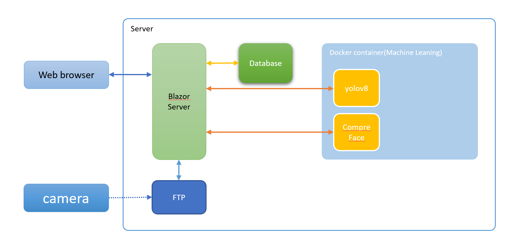
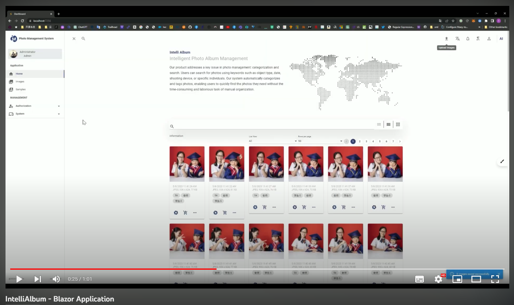

## IntelliAlbum - Intelligent Photo Album Management System

IntelliAlbum is an application designed specifically for photo studios and photographers to address the challenges of managing large volumes of photos and identifying the photos that clients prefer. By combining technology and artificial intelligence, this system provides a comprehensive solution that enables users to easily manage, filter, and customize photo albums.

### Architecture

## Technologies
- Visual Studio.net 2022
- .Net 7.0
- Blazor Server Application
- Microsoft SQL Server (Supports PostgreSQL)
- yolov8 + fastapi
- compreface
- Docker

## Docker Container

Build Docker Image
- ./src/yolov8-fastapi/docker-compose.yaml
- ./src/CompreFace/custom-builds/SubCenter-ArcFace-r100/docker-compose.yaml

### Key Features of the System:

1. Photo Scanning and Metadata Extraction: The system scans photos and retrieves their file paths along with metadata information such as capture time, location, camera, aperture, ISO, and more. This information helps in quickly locating and identifying photos.

2. Photo Compression: The system offers four levels of photo compression options - s (small), m (medium), l (large), and xl (original size) - to meet the requirements of different photo display and storage needs.

3. Database Storage: The system stores the file paths and metadata of photos in a database for quick retrieval and management. This allows users to easily search and filter photos based on specific information or tags.

4. Image Analysis and Object Recognition: The system utilizes artificial intelligence technology to analyze each photo and identify objects within them. The objects are classified into two main categories: Person and Object. This provides users with a convenient way to filter and categorize photos.

5. Face Recognition: For photos classified as Person, the system employs facial recognition using artificial intelligence to identify faces in the photos and saves the recognized data in the database. This enables users to easily find photos of the same person.

6. Quick Search and Similarity Matching: The system allows users to perform fast searches based on the information identified in the photos. Users can search for relevant photos using metadata information or by utilizing photo similarity. This greatly enhances the efficiency of photo search and management.

7. Bundle Download and Order Creation: Once users have selected their favorite photos, the system enables them to bundle and download those photos. Additionally, users can create new orders to submit selected photos to photographers or photo studios for album creation or photo enhancement. The completed albums are then printed and delivered to the users.

### Features and Advantages:

1. Powerful Intelligent Functionality: IntelliAlbum utilizes artificial intelligence and image analysis technology to automatically analyze and identify elements such as scenes and faces within the photos. This enables users to quickly find photos of specific scenes, objects, or individuals, greatly improving the efficiency and accuracy of photo management.

2. Intelligent Search and Filtering: Through metadata information and intelligent recognition capabilities, IntelliAlbum allows users to perform quick searches and filtering based on criteria such as capture time, location, camera settings, and more. Without the need for manual organizing and tagging, users can easily find their favorite photos.

3. Automatic Face Recognition: IntelliAlbum intelligently recognizes faces within the photos and saves the identified facial data in the database. This allows users to conveniently browse through photos of the same individual and create personal albums or review individuals' photos.

4. Efficient Photo Management: IntelliAlbum provides an intuitive user interface and user-friendly workflows, enabling users to quickly upload, browse, and organize photos. Whether for personal users, photo studios, or photographers, it facilitates easy management of large volumes of photos, saving time and effort.

5. Flexible Photo Customization: Users can choose different levels of photo compression (s, m, l, xl) for storage and sharing based on their preferences and requirements. Additionally, IntelliAlbum supports photo similarity matching and automatic album generation, assisting users in creating personalized photo albums.

6. High Security

 and Reliability: IntelliAlbum incorporates advanced data encryption and security measures to ensure the privacy and security of user photos. The system also includes reliable data backup and recovery functionality to prevent photo loss or damage.

IntelliAlbum is a comprehensive photo album management system that combines intelligence, efficiency, and personalization. It provides a convenient and intelligent photo management experience for photo studios, photographers, and individual users. Whether searching for specific photos, organizing albums, bundling downloads, customizing albums, or creating orders, IntelliAlbum meets users' needs. It simplifies the cumbersome process of photo management, allowing users to focus on enjoying and sharing wonderful memories.

Through IntelliAlbum, photo studios and photographers can provide more efficient services. They can quickly upload captured photos to the system and utilize intelligent recognition and search functionalities to enhance the photo selection experience for clients. Clients can easily choose their preferred photos through an intuitive interface and create new orders, requesting photo studios or designers to create albums or enhance photos. Ultimately, they receive beautifully printed albums delivered to their hands.

In summary, IntelliAlbum is a powerful and intelligent photo album management system that utilizes advanced technology and algorithms to provide efficient, intelligent photo management, and customization experiences. Whether you are a photo studio, photographer, or individual user, IntelliAlbum helps you effortlessly manage, filter, and customize photo albums, ensuring each photo is showcased and cherished to its fullest extent.