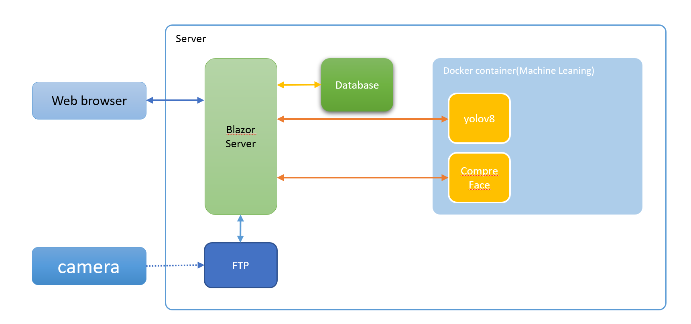
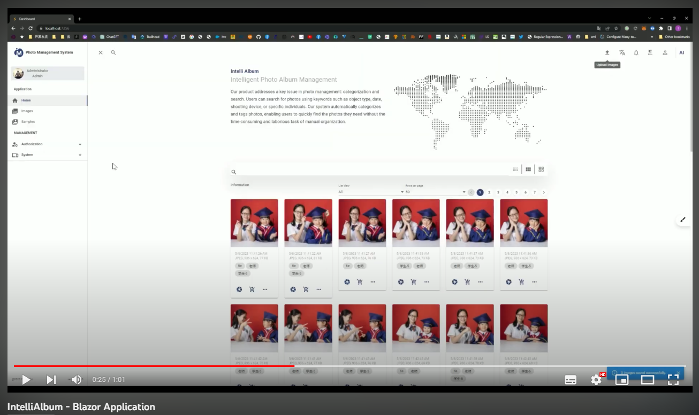

## IntelliAlbum-智能相册管理系统

智能相册管理系统是一款专为照相馆和摄影师设计的应用程序，旨在解决在接收任务或新业务时，管理大量照片并找出客户喜欢的照片的问题。通过结合技术和人工智能，该系统提供了一套完整的解决方案，使用户能够轻松地管理、筛选和定制照片相册。

### 系统架构

## 技术
- Visual Studio.net 2022
- .Net 7.0
- Blazor Server Application
- Microsoft SQL Server(Support PostgreSQL)
- yolov8 + fastapi
- compreface
- Docker

## 运行环境

Build Docker Image
- ./src/yolov8-fastapi/docker-compose.yaml
- ./src/CompreFace/custom-builds/SubCenter-ArcFace-r100/docker-compose.yaml

### 系统的主要功能如下：

1. 照片扫描和元数据提取：系统可以扫描照片并读取其路径位置以及包括拍摄时间、位置、相机、光圈、ISO等元数据信息。这些信息有助于快速定位和识别照片。

2. 照片压缩：系统提供了四个级别的照片压缩选项，包括s（最小）、m（中）、l（大）和xl（原始大小），以满足不同需求下的照片展示和存储要求。

3. 数据库存储：系统将照片的路径和元数据保存到数据库中，以便快速检索和管理。这样，用户可以方便地根据特定的信息或标签搜索和过滤照片。

4. 图像分析和对象识别：系统利用人工智能技术对每张照片进行分析，并识别照片中的景物。主要分为两大类，一类是Person（人物），另一类是Object（物体）。这为用户提供了更方便的筛选和分类照片的方式。

5. 人脸识别：对于属于Person类别的照片，系统还利用人工智能技术对照片中的人脸进行识别，并将识别出的数据保存到数据库中，以便以后进行对比和查找。这样用户可以轻松地找到同一个人的照片。

6. 快速查找和相似度匹配：系统让用户能够通过照片中识别出的信息进行快速查找。用户可以根据照片中的元数据信息或者利用照片的相似度来查找相关的照片。这大大提高了用户查找和管理照片的效率。

7. 打包下载和创建订单：当用户选中自己喜欢的照片后，系统允许用户将这些照片打包下载。同时，用户还可以创建新的订单，将选中的照片提交给摄影师或照相馆，以便进行相册制作或照片美化，并将相册打印后寄送给用户。

### 特点和优点：
1. 强大的智能化功能：IntelliAlbum利用人工智能和图像分析技术，能够自动分析和识别照片中的景物、人脸等元素。这使得用户可以快速找到特定场景、物体或人物的照片，大大提高了照片管理的效率和准确性。

2. 智能搜索和筛选：通过照片的元数据信息和智能识别功能，IntelliAlbum允许用户根据拍摄时间、地点、相机设置等条件进行快速搜索和筛选。无需手动整理和标记照片，用户可以轻松地找到自己喜欢的照片。

3. 自动人脸识别：IntelliAlbum能够智能识别照片中的人脸，并将识别出的人脸数据保存到数据库中。这样，用户可以方便地浏览同一个人的照片，并创建个人相册或进行人物回顾。

4. 高效的照片管理：IntelliAlbum提供了直观的用户界面和友好的操作流程，使用户能够快速上传、浏览和整理照片。无论是个人用户还是照相馆、摄影师，都可以轻松管理大量照片，节省时间和精力。

5. 灵活的照片定制：用户可以根据自己的喜好和需求，选择不同的照片压缩级别（s、m、l、xl）进行存储和分享。同时，IntelliAlbum还支持照片相似度匹配和自动相册生成，帮助用户创建个性化的照片相册。

6. 高安全性和可靠性：IntelliAlbum采用先进的数据加密和安全措施，确保用户照片的隐私和安全。系统具备可靠的数据备份和恢复功能，防止照片丢失或损坏。

IntelliAlbum是一款集智能化、高效性和个性化于一体的相册管理系统，为照相馆、摄影师和个人用户提供了便捷、智能的照片管理体验。无论是寻找特定照片、整理相册，还是打包下载、定制相册或创建订单，IntelliAlbum都能满足用户的需求。它简化了繁琐的照片管理流程，让用户能够专注于欣赏和分享精彩的回忆。

通过IntelliAlbum，照相馆和摄影师可以提供更高效的服务。他们可以将拍摄的照片快速上传到系统，利用智能识别和搜索功能为客户提供更好的选片体验。客户能够通过直观的界面，轻松选择自己喜欢的照片，并可以创建新的订单，请求照相馆或设计师制作相册或美化照片，最终获得精美的打印相册邮寄到手。

总之，IntelliAlbum是一款功能强大、智能化的相册管理系统，它利用先进的技术和算法，提供高效、智能的照片管理和定制体验。不论您是照相馆、摄影师还是个人用户，IntelliAlbum都能帮助您轻松管理、筛选和定制照片相册，让每一张照片都能得到最好的展示和回忆。
